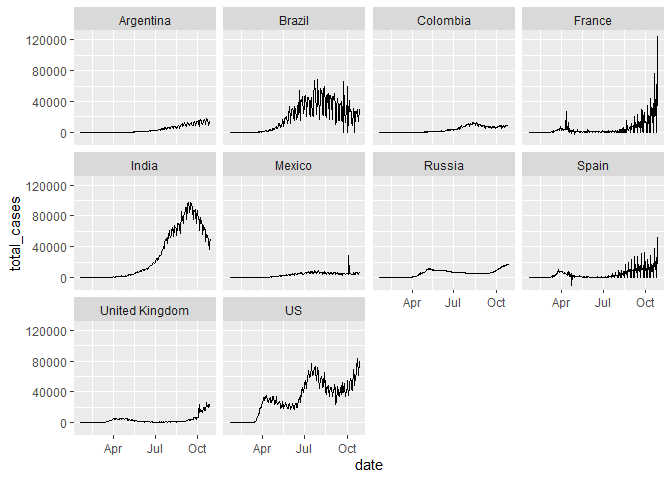
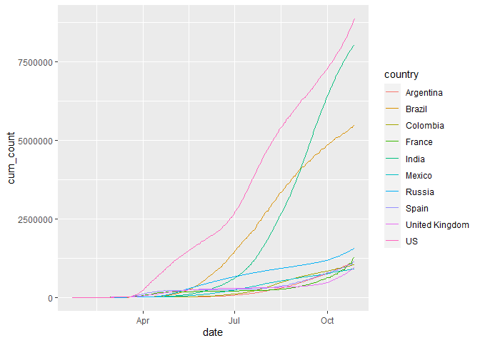

file=cumulative and facet example
================

### sample code to graph cumulative summations

#### plot height growth of seedlings through time, facet by species

``` r
# code from C:\Users\pjs23\Documents\R\ntres6940\Lessons-pdf-6940-data-science\Lesson 9_ ggplot part 2.pdf
```

``` r
library(tidyverse)
```

    ## -- Attaching packages --------------------------------------- tidyverse 1.3.0 --

    ## v ggplot2 3.3.2     v purrr   0.3.4
    ## v tibble  3.0.3     v dplyr   1.0.2
    ## v tidyr   1.1.2     v stringr 1.4.0
    ## v readr   1.4.0     v forcats 0.5.0

    ## -- Conflicts ------------------------------------------ tidyverse_conflicts() --
    ## x dplyr::filter() masks stats::filter()
    ## x dplyr::lag()    masks stats::lag()

``` r
# read datafile
# 
coronavirus <- read_csv('https://raw.githubusercontent.com/RamiKrispin/coronavirus/master/csv/coronavirus.csv', col_types = cols(province = col_character()))


#graph with facet by country
#

top10_countries <- coronavirus %>%
filter(type == "confirmed") %>%
group_by(country) %>%
summarize(total_cases = sum(cases)) %>%
arrange(-total_cases) %>%
head(10) %>%
.$country
```

    ## `summarise()` ungrouping output (override with `.groups` argument)

``` r
coronavirus %>%
filter(type == "confirmed", country %in% top10_countries) %>%
group_by(country, date) %>%
summarize(total_cases = sum(cases)) %>%
ggplot(mapping = aes(x = date, y = total_cases)) +
geom_line() +
facet_wrap(~country)
```

    ## `summarise()` regrouping output by 'country' (override with `.groups` argument)

<!-- -->

``` r
#cumulative of quantitative variable
#
coronavirus %>%
filter(type == "confirmed", country %in% top10_countries) %>%
group_by(country) %>%
arrange(date) %>%
mutate(cum_count = cumsum(cases)) %>%
ggplot(mapping = aes(x = date, y = cum_count, color = country)) +
geom_line()
```

<!-- -->
