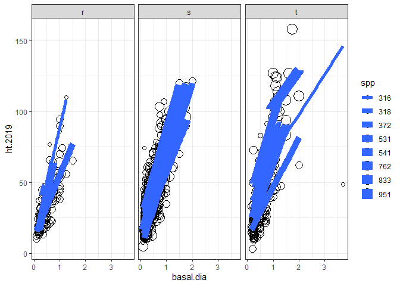
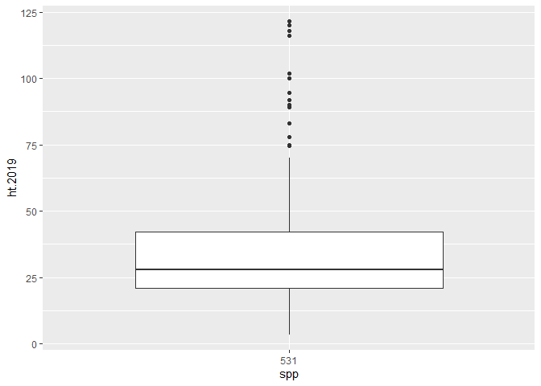

seedling height analysis
================
Peter Smallidge
10/16/2020

### Analysis of seedling heights 2018 & 2019

### read data from csv file, check variables and data structure

<!-- note to self: in the "read_csv" code, after the file location the code
for 'col..." etc ensures that the specified column is adjusted
the file "cheat sheet data-import" has details -->

``` r
input.data = read_csv("~/R/slash-wall-vegetation/height-data-2019.csv",
                      col_types=cols(spp=col_character()))
str(input.data)
```

    ## tibble [1,158 x 13] (S3: spec_tbl_df/tbl_df/tbl/data.frame)
    ##  $ harvest  : chr [1:1158] "Boot" "Boot" "Boot" "Boot" ...
    ##  $ season   : num [1:1158] 2019 2019 2019 2019 2019 ...
    ##  $ samp.date: chr [1:1158] "2020.06.19" "2020.06.19" "2020.06.16" "2020.06.16" ...
    ##  $ location : chr [1:1158] "interior" "perimeter" "interior" "interior" ...
    ##  $ point    : num [1:1158] 358 953 350 350 950 954 950 350 369 951 ...
    ##  $ spp      : chr [1:1158] "531" "531" "531" "531" ...
    ##  $ origin   : chr [1:1158] "r" "r" "r" "r" ...
    ##  $ basal.dia: num [1:1158] 0.25 0.5 1 1 0.6 0.5 1 0.3 1.5 0.65 ...
    ##  $ tot.ht   : num [1:1158] 14.5 20 45.5 56 21 26 47.5 28.5 65.5 51.5 ...
    ##  $ yr.curr  : num [1:1158] 2019 2019 2019 2019 2019 ...
    ##  $ inc.2019 : num [1:1158] 12 12 17 22 11 14 15 9.5 13.5 18 ...
    ##  $ yr.prev  : num [1:1158] 2018 2018 2018 2018 2018 ...
    ##  $ inc.2018 : num [1:1158] 2.5 3 3 4 6.5 8 8 8.5 9 11 ...
    ##  - attr(*, "spec")=
    ##   .. cols(
    ##   ..   harvest = col_character(),
    ##   ..   season = col_double(),
    ##   ..   samp.date = col_character(),
    ##   ..   location = col_character(),
    ##   ..   point = col_double(),
    ##   ..   spp = col_character(),
    ##   ..   origin = col_character(),
    ##   ..   basal.dia = col_double(),
    ##   ..   tot.ht = col_double(),
    ##   ..   yr.curr = col_double(),
    ##   ..   inc.2019 = col_double(),
    ##   ..   yr.prev = col_double(),
    ##   ..   inc.2018 = col_double()
    ##   .. )

``` r
ht.data <- input.data %>% 
  rename(ht.2019 = tot.ht)  # (new name = old name)


# in an earlier csv file there was an "S" and all should have been lower case. 
# I changed the value in the original data file


table(ht.data$spp)
```

    ## 
    ## 125 129 316 318 356 371 372 375 531 541 621 651  70 740 762 802 832 833 901 951 
    ##   1   6 154  89   5   9 148  13 323 195   7   2   1   3  34   8  23 113   1  23

``` r
table(ht.data$origin)
```

    ## 
    ##   r   s   t 
    ## 138 676 344

``` r
glimpse(ht.data)
```

    ## Rows: 1,158
    ## Columns: 13
    ## $ harvest   <chr> "Boot", "Boot", "Boot", "Boot", "Boot", "Boot", "Boot", "...
    ## $ season    <dbl> 2019, 2019, 2019, 2019, 2019, 2019, 2019, 2019, 2019, 201...
    ## $ samp.date <chr> "2020.06.19", "2020.06.19", "2020.06.16", "2020.06.16", "...
    ## $ location  <chr> "interior", "perimeter", "interior", "interior", "perimet...
    ## $ point     <dbl> 358, 953, 350, 350, 950, 954, 950, 350, 369, 951, 360, 74...
    ## $ spp       <chr> "531", "531", "531", "531", "531", "531", "531", "531", "...
    ## $ origin    <chr> "r", "r", "r", "r", "r", "r", "r", "r", "r", "r", "r", "r...
    ## $ basal.dia <dbl> 0.25, 0.50, 1.00, 1.00, 0.60, 0.50, 1.00, 0.30, 1.50, 0.6...
    ## $ ht.2019   <dbl> 14.5, 20.0, 45.5, 56.0, 21.0, 26.0, 47.5, 28.5, 65.5, 51....
    ## $ yr.curr   <dbl> 2019, 2019, 2019, 2019, 2019, 2019, 2019, 2019, 2019, 201...
    ## $ inc.2019  <dbl> 12.0, 12.0, 17.0, 22.0, 11.0, 14.0, 15.0, 9.5, 13.5, 18.0...
    ## $ yr.prev   <dbl> 2018, 2018, 2018, 2018, 2018, 2018, 2018, 2018, 2018, 201...
    ## $ inc.2018  <dbl> 2.5, 3.0, 3.0, 4.0, 6.5, 8.0, 8.0, 8.5, 9.0, 11.0, 22.5, ...

``` r
skim(ht.data)
```

|                                                  |         |
| :----------------------------------------------- | :------ |
| Name                                             | ht.data |
| Number of rows                                   | 1158    |
| Number of columns                                | 13      |
| \_\_\_\_\_\_\_\_\_\_\_\_\_\_\_\_\_\_\_\_\_\_\_   |         |
| Column type frequency:                           |         |
| character                                        | 5       |
| numeric                                          | 8       |
| \_\_\_\_\_\_\_\_\_\_\_\_\_\_\_\_\_\_\_\_\_\_\_\_ |         |
| Group variables                                  | None    |

Data summary

**Variable type: character**

| skim\_variable | n\_missing | complete\_rate | min | max | empty | n\_unique | whitespace |
| :------------- | ---------: | -------------: | --: | --: | ----: | --------: | ---------: |
| harvest        |          0 |              1 |   1 |   4 |     0 |         7 |          0 |
| samp.date      |          0 |              1 |  10 |  10 |     0 |        39 |          0 |
| location       |          0 |              1 |   7 |   9 |     0 |         3 |          0 |
| spp            |          0 |              1 |   2 |   3 |     0 |        20 |          0 |
| origin         |          0 |              1 |   1 |   1 |     0 |         3 |          0 |

**Variable type: numeric**

| skim\_variable | n\_missing | complete\_rate |    mean |     sd |     p0 |     p25 |     p50 |    p75 |   p100 | hist  |
| :------------- | ---------: | -------------: | ------: | -----: | -----: | ------: | ------: | -----: | -----: | :---- |
| season         |          0 |              1 | 2019.00 |   0.00 | 2019.0 | 2019.00 | 2019.00 | 2019.0 | 2019.0 | ▁▁▇▁▁ |
| point          |          0 |              1 |  713.65 | 209.26 |  334.0 |  702.00 |  801.50 |  858.0 |  975.0 | ▅▁▁▇▆ |
| basal.dia      |          0 |              1 |    0.51 |   0.36 |    0.1 |    0.25 |    0.45 |    0.7 |    5.0 | ▇▁▁▁▁ |
| ht.2019        |          0 |              1 |   42.10 |  23.43 |    3.5 |   24.00 |   36.50 |   55.0 |  158.0 | ▇▆▂▁▁ |
| yr.curr        |          0 |              1 | 2019.00 |   0.00 | 2019.0 | 2019.00 | 2019.00 | 2019.0 | 2019.0 | ▁▁▇▁▁ |
| inc.2019       |          0 |              1 |   16.13 |  10.20 |    0.5 |    9.00 |   14.00 |   21.0 |   95.0 | ▇▃▁▁▁ |
| yr.prev        |          0 |              1 | 2018.00 |   0.00 | 2018.0 | 2018.00 | 2018.00 | 2018.0 | 2018.0 | ▁▁▇▁▁ |
| inc.2018       |          0 |              1 |   11.81 |   8.96 |    0.0 |    5.50 |    9.00 |   16.0 |   64.5 | ▇▃▁▁▁ |

``` r
#str(ht.data)  there are 1158 rows in original data frame
head(ht.data)
```

    ## # A tibble: 6 x 13
    ##   harvest season samp.date location point spp   origin basal.dia ht.2019 yr.curr
    ##   <chr>    <dbl> <chr>     <chr>    <dbl> <chr> <chr>      <dbl>   <dbl>   <dbl>
    ## 1 Boot      2019 2020.06.~ interior   358 531   r           0.25    14.5    2019
    ## 2 Boot      2019 2020.06.~ perimet~   953 531   r           0.5     20      2019
    ## 3 Boot      2019 2020.06.~ interior   350 531   r           1       45.5    2019
    ## 4 Boot      2019 2020.06.~ interior   350 531   r           1       56      2019
    ## 5 Boot      2019 2020.06.~ perimet~   950 531   r           0.6     21      2019
    ## 6 Boot      2019 2020.06.~ perimet~   954 531   r           0.5     26      2019
    ## # ... with 3 more variables: inc.2019 <dbl>, yr.prev <dbl>, inc.2018 <dbl>

``` r
#dim(ht.data)
```

### Make the data tidy

### Use Pivot

``` r
# seedling heights were measured after the 2019 growing season
# the height of the seedling at end of 2019 recorded as ht.2019
# the growth increment for 2019 = inc.2019
# the growth increment for 2019 = inc.2018

ht.data2 <- ht.data %>% 
  mutate(
    ht.2018 = ht.2019 - inc.2019,
    ht.2017 = ht.2018 - inc.2018
   
  )
#   yr.original = 2017

#seedling <- 
#  pivot_longer(ht.data, c())
```

### Determine average total height at end of 2019

``` r
# determine average total height and annual increment by harvest, origin, and spp
# 1. filter to retain priority species
# 2. select numeric variable
# 3. group by harvest, origin, and spp
# 4. summarize
ht.avg <- ht.data %>% 
  filter(spp == "531" |spp == "316" | spp == "318" | spp == "356" | spp == "372" |
          spp == "375" |spp ==  "541" | spp ==  "621" | spp ==  "743" | spp ==  "761" |
            spp == "762" | spp == "833" | spp == "951") %>% 
  select(harvest, origin, spp, ht.2019, inc.2019, inc.2018, basal.dia) %>% 
  group_by(harvest, origin, spp) %>% 
  add_count(spp) %>% 
  summarise(
    ht.2019 = mean(ht.2019),
    inc.2019 = mean(inc.2019),
    n=n()
  )
```

    ## `summarise()` regrouping output by 'harvest', 'origin' (override with `.groups` argument)

``` r
(ht.avg)
```

    ## # A tibble: 102 x 6
    ## # Groups:   harvest, origin [21]
    ##    harvest origin spp   ht.2019 inc.2019     n
    ##    <chr>   <chr>  <chr>   <dbl>    <dbl> <int>
    ##  1 Boot    r      531      37.8    14.1     11
    ##  2 Boot    s      316      27.7    12.6      5
    ##  3 Boot    s      318      12.8     4.75     2
    ##  4 Boot    s      372      48.7    33.4     32
    ##  5 Boot    s      375      51.7    31.3      3
    ##  6 Boot    s      531      48.6     9.14    14
    ##  7 Boot    s      541      28.0    19.4     23
    ##  8 Boot    s      762      61      26        1
    ##  9 Boot    s      833      23.5     9.5      2
    ## 10 Boot    s      951      18      10        1
    ## # ... with 92 more rows

``` r
dim(ht.avg)
```

    ## [1] 102   6

### Calcuate Species Heights for Boot and Wedge Combined VS Control Plots

``` r
# mean height values for select species in boot or wedge harvests vs. controls of boot/wedge
# 1. import ht.data, all values
# 2. filter beech plus desired species
# 3. filter rows of data from boot, wedge or their control areas
# 4. filter to retain interior or control plots
# 5. select to retain focal variables
# 6. group by location (interior vs. control) and by species
# 7. count and summarize total height (ht.2019)

glimpse(ht.data)
```

    ## Rows: 1,158
    ## Columns: 13
    ## $ harvest   <chr> "Boot", "Boot", "Boot", "Boot", "Boot", "Boot", "Boot", "...
    ## $ season    <dbl> 2019, 2019, 2019, 2019, 2019, 2019, 2019, 2019, 2019, 201...
    ## $ samp.date <chr> "2020.06.19", "2020.06.19", "2020.06.16", "2020.06.16", "...
    ## $ location  <chr> "interior", "perimeter", "interior", "interior", "perimet...
    ## $ point     <dbl> 358, 953, 350, 350, 950, 954, 950, 350, 369, 951, 360, 74...
    ## $ spp       <chr> "531", "531", "531", "531", "531", "531", "531", "531", "...
    ## $ origin    <chr> "r", "r", "r", "r", "r", "r", "r", "r", "r", "r", "r", "r...
    ## $ basal.dia <dbl> 0.25, 0.50, 1.00, 1.00, 0.60, 0.50, 1.00, 0.30, 1.50, 0.6...
    ## $ ht.2019   <dbl> 14.5, 20.0, 45.5, 56.0, 21.0, 26.0, 47.5, 28.5, 65.5, 51....
    ## $ yr.curr   <dbl> 2019, 2019, 2019, 2019, 2019, 2019, 2019, 2019, 2019, 201...
    ## $ inc.2019  <dbl> 12.0, 12.0, 17.0, 22.0, 11.0, 14.0, 15.0, 9.5, 13.5, 18.0...
    ## $ yr.prev   <dbl> 2018, 2018, 2018, 2018, 2018, 2018, 2018, 2018, 2018, 201...
    ## $ inc.2018  <dbl> 2.5, 3.0, 3.0, 4.0, 6.5, 8.0, 8.0, 8.5, 9.0, 11.0, 22.5, ...

``` r
tail(ht.data)
```

    ## # A tibble: 6 x 13
    ##   harvest season samp.date location point spp   origin basal.dia ht.2019 yr.curr
    ##   <chr>    <dbl> <chr>     <chr>    <dbl> <chr> <chr>      <dbl>   <dbl>   <dbl>
    ## 1 W         2019 2020.06.~ perimet~   970 531   t           0.25    12      2019
    ## 2 W         2019 2020.06.~ perimet~   973 531   t           0.15    19.5    2019
    ## 3 W         2019 2020.06.~ interior   383 951   t           1.6    127      2019
    ## 4 W         2019 2020.06.~ interior   379 951   t           1.25   100      2019
    ## 5 W         2019 2020.06.~ perimet~   968 951   t           1.75   158      2019
    ## 6 W         2019 2020.06.~ perimet~   971 951   t           1.1    118      2019
    ## # ... with 3 more variables: inc.2019 <dbl>, yr.prev <dbl>, inc.2018 <dbl>

``` r
table(ht.data$harvest) # display the values in the variable "harvest"
```

    ## 
    ## Boot  CGL  CRP  CWB   GL   RP    W 
    ##  139   94  145  139  399  154   88

``` r
ht.avg.boot.wedge <- ht.data %>% 
  filter(spp == "531" |spp == "316" | spp == "318" | spp == "356" | spp == "372" |
          spp == "375" |spp ==  "541" | spp ==  "621" | spp ==  "743" | spp ==  "761" |
            spp == "762" | spp == "833" | spp == "951") %>% 
  filter(harvest == "Boot" | harvest == "W" | harvest == "CWB") %>% 
  #(ht.avg.boot.wedge)
  #
  
  filter(location == "interior" | location == "control") %>% 
  #(ht.avg.boot.wedge)
  #

  select(harvest, location, origin, spp, ht.2019, inc.2019, inc.2018, basal.dia) %>% 
  
  group_by( location, spp) %>% 
  add_count(spp) %>% 
  summarise(
    ht.2019 = mean(ht.2019),
    inc.2019 = mean(inc.2019),
    n=n()
  )
```

    ## `summarise()` regrouping output by 'location' (override with `.groups` argument)

``` r
(ht.avg.boot.wedge)
```

    ## # A tibble: 15 x 5
    ## # Groups:   location [2]
    ##    location spp   ht.2019 inc.2019     n
    ##    <chr>    <chr>   <dbl>    <dbl> <int>
    ##  1 control  316      26      13.5      3
    ##  2 control  318      22.5     6.62     4
    ##  3 control  372      39.7    20.9     32
    ##  4 control  531      36.8    11.7     50
    ##  5 control  541      31.1    11.9     36
    ##  6 control  833      31.7     3.17     3
    ##  7 control  951      55      19        1
    ##  8 interior 316      52.9    17.3     15
    ##  9 interior 318      45.3    21.9      6
    ## 10 interior 372      45.3    29.7     35
    ## 11 interior 531      31.2    10.8     43
    ## 12 interior 541      27.2    19.0     23
    ## 13 interior 762      32.8    11.5      2
    ## 14 interior 833      28       8        1
    ## 15 interior 951     112.     43.8      6

``` r
write.table(ht.avg.boot.wedge, "boot_wedge_ht.txt", sep="\t")
```

### Calcuate Species Heights for Gas Line Interior VS Control Plots

``` r
# mean height values for select species in gas line harvests vs. controls of gas line

# 1. import ht.data, all values
# 2. filter beech plus desired species
# 3. filter rows of data from gas line or their control areas
# 4. filter to retain interior or control plots
# 5. select to retain focal variables
# 6. group by location (interior vs. control) and by species
# 7. count and summarize total height (ht.2019)

#glimpse(ht.data)
#tail(ht.data)
table(ht.data$harvest) # display the values in the variable "harvest"
```

    ## 
    ## Boot  CGL  CRP  CWB   GL   RP    W 
    ##  139   94  145  139  399  154   88

``` r
ht.avg.gasline <- ht.data %>% 
  filter(spp == "531" |spp == "316" | spp == "318" | spp == "356" | spp == "372" |
          spp == "375" |spp ==  "541" | spp ==  "621" | spp ==  "743" | spp ==  "761" |
            spp == "701" | spp == "762" | spp == "833" | spp == "951") %>% 
 #glimpse(ht.avg.gasline), spp 701 = Ostrya
  
  
  filter(harvest == "GL" | harvest == "CGL") %>% 
 #glimpse(ht.avg.gasline)
  
  
  filter(location == "interior" | location == "control") %>% 
# glimpse(ht.avg.gasline)
  

  select(harvest, location, origin, spp, ht.2019, inc.2019, inc.2018, basal.dia) %>% 
  
  group_by( location, spp) %>% 
  add_count(spp) %>% 
  summarise(
    ht.2019 = mean(ht.2019),
    inc.2019 = mean(inc.2019),
    n=n()
  )
```

    ## `summarise()` regrouping output by 'location' (override with `.groups` argument)

``` r
#glimpse(ht.avg.gasline)

write.table(ht.avg.gasline, "gasline_ht.txt", sep="\t")
```

### Visualize data relationships

``` r
library(ggplot2)

ht.data.com <- ht.data %>% 
  filter(spp == "531" |spp == "316" | spp == "318"  | spp == "372" |
           spp ==  "541"  |
            spp == "762" | spp == "833" | spp == "951") 

ggplot(data=ht.data.com, mapping = aes(x=basal.dia, y = ht.2019, size = spp)) +
  geom_point(mapping = aes(size = spp), shape = 1) +
  geom_smooth(method="lm", se=F) +
  facet_wrap(~origin, nrow=1) +
  theme_bw()
```

    ## Warning: Using size for a discrete variable is not advised.

    ## `geom_smooth()` using formula 'y ~ x'

<!-- -->

``` r
ht.data.com %>% 
  filter(spp==531) %>% 
  group_by(origin) %>% 
  ggplot()+
    geom_boxplot(mapping=aes(x=spp, y=ht.2019))
```

<!-- -->
